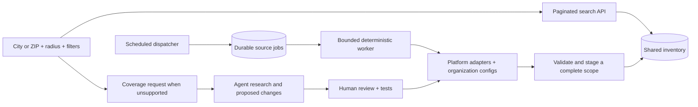

# Proposed architecture: shared inventory, reusable collectors

Status: proposal; nothing in this document has been deployed.

## Keep the pilot small

Keep React, the existing TypeScript backend and Turso/libSQL. Keep Netlify for the frontend/API. Add durable job records and a scheduled dispatcher, with a background worker appropriate to the account's function capabilities. Introducing Go, MongoDB, Kubernetes or a container fleet is unnecessary for this pilot. If measured jobs exceed platform limits, move the worker behind the same job/adapter contract to a small scheduled worker service; the website and database need not move with it.

Netlify scheduling is a trigger, not durable job storage. Its documented scheduled-function duration is 30 seconds; background functions allow longer execution with retries. Verify account availability and budgets during implementation. See [provider requirements](provider-requirements.md) for primary documentation. Never promise free nationwide operation based on the free tier.

## Data model and invariants

Use explicit tables or equivalent normalized records; names below are proposed.

| Entity | Key fields and purpose |
|---|---|
| `organizations` | Internal ID, names/aliases, official URL, geographic service hints; do not equate service area with pet location |
| `locations` | Organization/campus, public locality and coordinates, precision, evidence URL/date, verification state |
| `source_configs` | Adapter family/version, upstream organization identifier, public entry URL, allowed hosts, operational/access review, attribution, enabled state |
| `collection_scopes` | Config + immutable selector/version defining the population, e.g. organization's public cats; pagination strategy and completeness rules |
| `source_listings` | Namespaced upstream ID, raw public fields, normalized fields, canonical detail URL, source timestamps, first/last observed, status |
| `scope_memberships` | Scope + listing + last successful generation; makes overlap explicit |
| `collection_jobs` | Scope, due time, attempt, lease owner/expiry/fencing token, idempotency key, state, counts/errors, completion evidence |
| `scan_staging` | Job/generation + listing; temporary validated records before publication |
| `listing_aliases` | Verified identity mappings and old Soul Cat keys; preserve existing references |
| `coverage_requests` | Coalesced geographic demand, source research state and reviewer decision; no per-user scraping queues |
| Future `favorites`, `saved_searches` | User-owned records referencing stable internal identities and versioned filter definitions |

Index source identity, status, normalized filter fields and usable geographic coordinates. Keep raw JSON for provenance, but do not rely on `SELECT *` plus client filtering for regional scale. Set retention rules by source; avoid storing entire upstream pages or ancillary organizational/contact fields just because a public response contains them.

### Identity and deduplication

Unique identity is platform + upstream organization + upstream animal ID unless a provider documents a globally unique ID. Do not use names, image order, or URL slugs as identity. Use the exact published adoption URL; a name can differ from its slug. Record redirect outcomes without silently replacing a profile with the organization's homepage.

Preserve separate source listings for the same animal. Link them only through verified shared IDs or explicit cross-links; names, appearance and images can generate review candidates, not automatic merges. Display the source and its check time for each link. Names and guessed matches must never cause two distinct cats to become one favorite.

### Scope-safe availability

Current `server/store.ts` reconciles by `source_id`, marking all that source's cats not listed before upserting. Reusing a source ID across city/radius scans would incorrectly remove cats outside the latest result set.

Reconcile only a successfully completed, validated scope generation. Missing from a radius search means missing from that scope, not adopted or globally unavailable. Keep memberships across overlapping scopes. On failed/partial enumeration, retain prior membership and show stale status. A proven complete empty response may remove memberships; a blank page or parse failure may not. Guard suspicious count drops for review, but do not use that guard to hold on to explicit removals or opt-outs.

Display `listed`, `not currently listed`, `stale/unverified`, and explicit provider status separately. Mark `adopted` only when the source says so. Administrative opt-out/deletion bypasses normal reconciliation immediately, including search caches and applicable saved content.

## Adapter contract

Separate `enumerate(scope, cursor)` from `fetchDetail(reference)`. Enumeration returns IDs, published links, summary fields, next cursor, reported total if any, and evidence of scope/filter application. Completeness means the adapter reached its documented terminal condition without missing pages or invalid records; nonempty output alone is insufficient.

Validate species, unique IDs, detail URL hosts, known field types, pagination loops, limits and duplicate pages. Record response time, status, byte count and adapter version. A source change invalidates its assumptions, not the whole app. Detail failures retain earlier verified details with their older timestamp; they must not make enumeration look complete or delete unrelated cats.

The two Shelterluv samples demonstrate a single-array endpoint and published `public_url` fields. Preserve only fields used for public discovery. PACC still needs pagination proof. Animal Foundation needs adoption-eligibility validation: its sampled pages include stray intake and Lied shelter placements; appearing under a cat filter is insufficient to promise immediate adoption.

## Jobs, scheduling and recovery

Start with the existing three daily refresh times as the pilot default; configure per source after observing limits and need. Spread jobs with jitter. A user refreshes the shared search result, not the shelter. For stale sources, an authorized refresh request may bring an already-due job forward under a cooldown and deduplication rule. No public endpoint should launch arbitrary URL fetches.

Dispatcher atomically inserts/claims due jobs and returns promptly. Worker leases a job, renews the lease if needed, and writes to staging. Publish validated records, memberships and successful-generation metadata transactionally. A fencing token prevents an expired worker from publishing after a replacement has taken over. Publication is idempotent by scope/generation; retries never double-count new cats. Track state in the database, not an elapsed-time guess in the frontend.

Use host-wide concurrency/request limits across sources sharing a platform, bounded timeouts and retry counts. Honor Retry-After, back off with jitter on 429/temporary failure, and stop repeated challenges. Start conservatively at one in-flight request per host, adapting only with measured evidence. Prefer changed-record detail enrichment when upstream semantics support it, with a periodic reconciliation sweep. Do not infer change timestamps from intake dates or age-group configuration timestamps.

## City/ZIP/radius search

Resolve input to a confirmed city/state or postal center, then query stored locations by bounding box followed by great-circle distance. Disambiguate same-name cities. Use miles consistently and test the radius boundary. A ZIP/city centroid is approximate, so distinguish approximate placement distances from verified campus distances. Unknown location cannot pass a strict geographic predicate by assigning the rescue headquarters.

Provide an optional separate group for nearby organizations whose animal placement is unknown. Label transport listings explicitly and exclude them by default from “located within” results. Never use found/intake addresses as adoptable placement. Do not expose exact private foster coordinates.

Show last successful observation, stale status and coverage by organization. If an area has no activated sources, explain limited coverage and register demand instead of claiming there are no cats. Offline US postal lookup is an option; validate licensing and data quality as described in provider requirements.

## Normalized filters

Store `breed_raw`, normalized breed IDs, mix flag, hair length, color IDs, pattern IDs, age estimate/range, source age category and normalization version. Dictionaries map explicit source terms; unfamiliar terms remain unmapped. Separate tortoiseshell pattern from breed, and provider-confirmed labels from visual suggestions. Visual suggestions must never overwrite source facts. No image-classification model is required in the pilot.

Build dropdowns from canonical values with counts for the current geographic inventory. Use exact membership filters rather than substring matching. Keep “unknown” intentional. Saved searches store canonical IDs and a schema version, not display labels.

## Accounts and saved preferences: later layer

Use a maintained authentication service/library rather than homegrown passwords. Choose it during the account milestone based on deployment support and actual free-tier limits; this study does not select or provision a vendor. Protect server-side sessions, enforce per-user ownership on every favorite/saved-search operation, and test that one user cannot read or modify another's records. Use secure cookies/CSRF protection appropriate to the chosen auth flow. Credentials remain server-only.

Offer explicit import of the browser's existing favorites after login. A disappearing listing remains a labeled saved reference only where the source's retention terms permit it; otherwise preserve just the user's compatible note/reference or remove restricted data. Account deletion removes personal preferences. Collection is shared and continues independently of who is logged in.

## Agent discovery and repair

Input: a coalesced area request or a failed-source alert. Output: organization identity, official adoption page, detected platform/config, sample IDs and exact links, pagination/availability/location evidence, access findings, cost estimate, and a proposed code/config change with tests. Agents can research and propose, not auto-activate.

Run proposed parsers against recorded minimal/synthetic fixtures and bounded public examples in a sandbox with host allowlists, no production database credentials, no arbitrary dependency installation, and time/request budgets. Treat page content as untrusted data. Human review approves activation; staging checks precede production. This can begin as repository issues/PRs, without a new orchestration service.

## Migration and rollback

1. Add schema alongside existing tables; back up using the existing database's supported export process during implementation.
2. Assign one legacy scope per current source and preserve all existing `source:animalId` aliases.
3. Backfill normalized fields and provenance without claiming inferred locations are verified. Record mapping version.
4. Shadow-read/write a small source; compare IDs, status and counts. Keep the current UI until parity is understood.
5. Switch source publication behind a feature flag; then switch paginated search. Preserve a rollback reader and stop the new worker before reverting publication.
6. Add new Shelterluv organizations only after source/scoping tests pass; add accounts after search identifiers settle.

Do not change production as part of this research deliverable.
